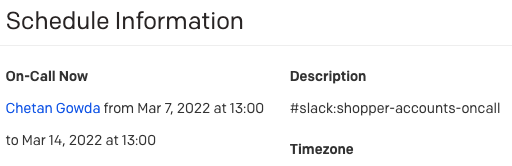

# pd2slack
Synchronizes PagerDuty schedules to Slack

## PagerDuty Integration

Add a `#slack:<group-name> tag to any PagerDuty schedule description to sync a schedule to a Slack group.

For example:

Results in `chetan@bolt.com` being added to `@shopper-accounts-oncall` Slack group for the Mar 7, 2022, to Mar 14,  2022
on-call rotation.

You can add the same `#slack:` tag to multiple Schedules to merge all on-call users for those schedules into a single
Slack group.